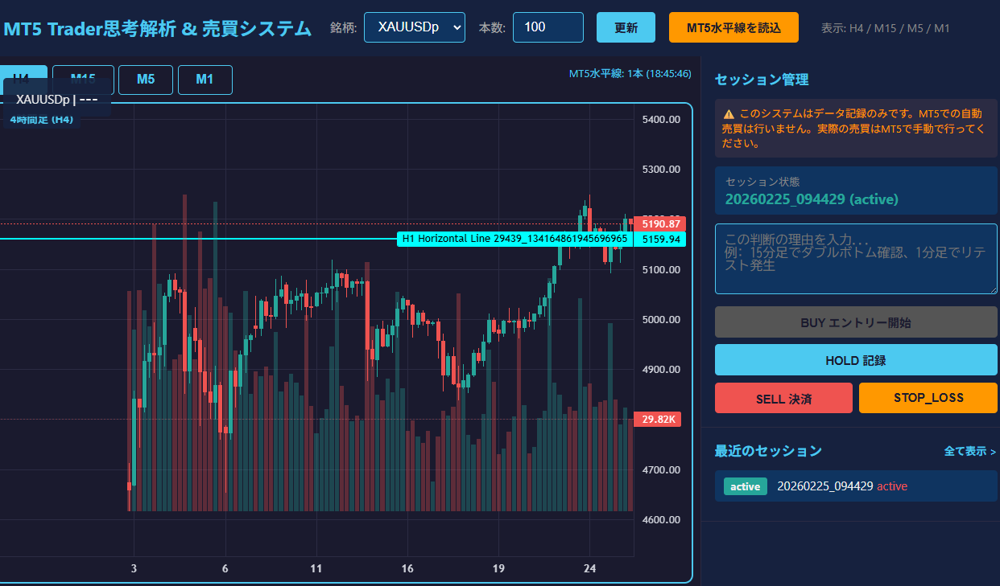
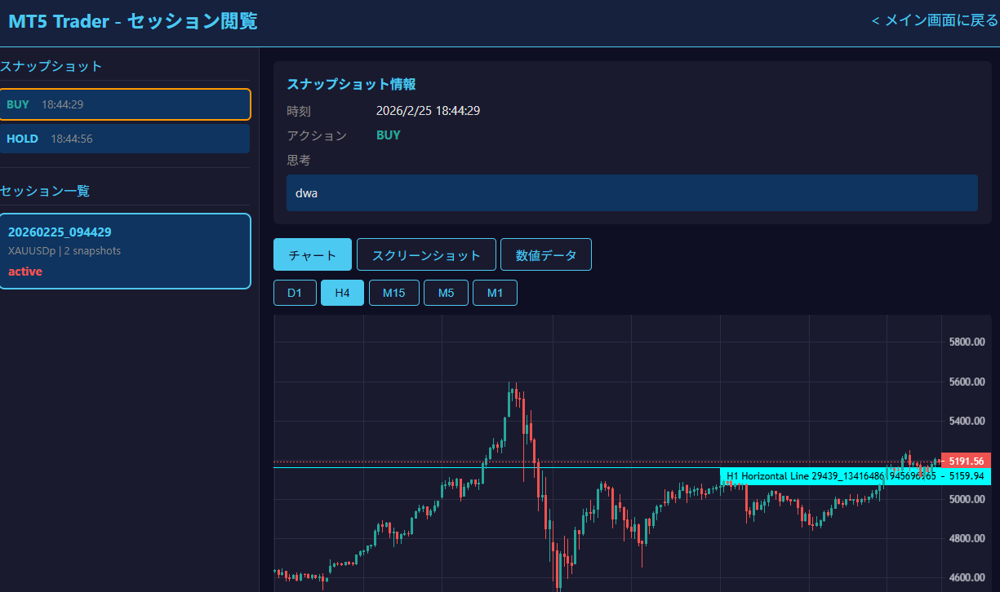

# MT5 Trader思考解析 & 売買システム

MT5トレーダーの取引行動と思考を記録・分析し、E2E模倣学習に活用するためのデータ収集システムです。

## システム画面

### メイン画面


- **チャート表示**: LightweightChartsによるローソク足チャート（H4/M15/M5/M1切り替え）
- **水平線表示**: MT5で描画した水平線をリアルタイム表示
- **セッション管理**: BUY → HOLD → SELL/STOP_LOSS の取引フロー記録

### セッション閲覧画面


- **過去セッション一覧**: 取引履歴の確認
- **スナップショット詳細**: 各時点のチャート、思考、インジケーターを確認
- **インタラクティブチャート**: OHLCデータと水平線を表示

---

## 動作環境

| 項目 | 要件 |
|------|------|
| **OS** | Windows 10/11 (64-bit) **必須** |
| **Python** | 3.11+ (64-bit) |
| **MetaTrader 5** | Build 4620+ |
| **RAM** | 8GB以上推奨 |

> **注意**: MetaTrader 5はWindows専用のため、このシステムはLinuxでは動作しません。
> 詳細: [実行環境セットアップガイド](docs/environment_setup.md)

---

## クイックスタート

### 前提条件
- Windows 10/11 (64-bit)
- Python 3.11+ (64-bit)
- MetaTrader 5 がインストール・起動済み
- MT5でXAUUSDp等の銘柄が表示可能

### インストール

```bash
# 依存関係インストール
pip install -r requirements.txt

# MQL5ファイルをMT5にコピー
# 詳細: docs/mt5_indicator_setup.md
```

### MT5セットアップ

1. `mql5/HorizontalLinesExporter.mq5` を `MQL5/Indicators/` にコピー
2. `mql5/ChartExporterEA.mq5` を `MQL5/Experts/` にコピー
3. MetaEditorでコンパイル
4. XAUUSDpチャートにアタッチ
5. アルゴリズム取引を有効化（緑色）

詳細: [MT5セットアップ手順](docs/mt5_indicator_setup.md)

### 起動

```bash
python app.py
```

ブラウザで http://127.0.0.1:8000 にアクセス

---

## 機能

| 機能 | 説明 |
|------|------|
| チャート表示 | H4/M15/M5/M1 時間足切り替え、水平線表示 |
| スクリーンショット | D1/H4/M15/M5/M1 の5時間足を自動キャプチャ |
| OHLCデータ収集 | マルチタイムフレームのローソク足データ |
| テクニカル指標 | RSI, MACD, SMA, EMA, ボリンジャーバンド |
| 思考記録 | 各取引判断時の理由をテキスト保存 |
| セッション管理 | BUY→HOLD→SELL/STOP_LOSSを1セッションとして管理 |

---

## プロジェクト構成

```
MT5/
├── app.py                 # FastAPI メインアプリケーション
├── requirements.txt       # 依存関係
├── config/               # 設定
├── collector/            # データ収集モジュール
├── models/               # データモデル
├── mql5/                 # MQL5ファイル（MT5用）
├── templates/            # Webフロントエンド
├── data/                 # 収集データ
│   └── sessions/         # セッションデータ
└── docs/                 # ドキュメント
```

---

## ドキュメント

- [システム概要](docs/system_overview.md)
- [実行環境セットアップガイド](docs/environment_setup.md)
- [MT5セットアップ手順](docs/mt5_indicator_setup.md)
- [セッション管理計画](docs/session_management_plan.md)
- [変更履歴](docs/CHANGELOG.md)

---

## 技術スタック

- **バックエンド**: Python, FastAPI, uvicorn
- **フロントエンド**: HTML5, JavaScript, Lightweight Charts
- **MT5連携**: MetaTrader5 Python API, MQL5
- **テクニカル分析**: ta (Technical Analysis Library)

---

## バージョン

v1.4.1 - 2026-02-25

## ライセンス

MIT License
