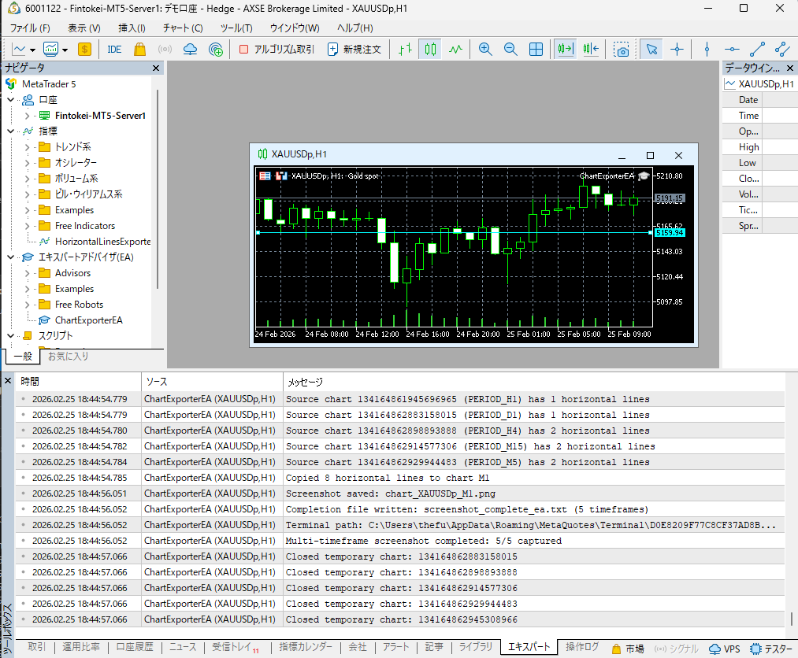

# MT5 MQL5セットアップ手順

MT5で必要なIndicatorとExpert Advisorのセットアップ手順です。

---

## 必要なMQL5ファイル

| ファイル | 種類 | 目的 |
|---------|------|------|
| `HorizontalLinesExporter.mq5` | Indicator | 水平線をJSONにエクスポート |
| `ChartExporterEA.mq5` | Expert Advisor | スクリーンショット取得（水平線付き） |

**注意:** `ChartExporter.mq5`（インジケータ版）は**使用不可**です。ChartOpen()がインジケータで動作しないため、EA版を使用してください。

---

## 1. HorizontalLinesExporter のインストール

MT5で手動描画した水平線をWebチャートに表示するためのIndicatorです。

### 1.1 MQL5ファイルをコピー

1. プロジェクトの `mql5/HorizontalLinesExporter.mq5` をコピー
2. MT5データフォルダ内の `MQL5\Indicators\` に貼り付け

```
コピー元: MT5プロジェクト/mql5/HorizontalLinesExporter.mq5
コピー先: C:\Users\<ユーザー名>\AppData\Roaming\MetaQuotes\Terminal\<ターミナルID>\MQL5\Indicators\
```

### 1.2 MetaEditorでコンパイル

1. MT5メニュー: **ツール → MetaEditor** (または `F4`)
2. `Ctrl+O` でファイルを開く、または左側ナビゲータで `Indicators/HorizontalLinesExporter.mq5` をダブルクリック
3. メニュー: **ビルド → コンパイル** (または `F7`)
4. 下部に「0 errors, 0 warnings」「code generated」と表示されれば成功

### 1.3 Indicatorをチャートに追加

1. MT5でナビゲーターを表示 (`Ctrl+N`)
2. **指標** → **HorizontalLinesExporter** をXAUUSDpチャートにドラッグ＆ドロップ
3. 確認ダイアログで「OK」をクリック

### 1.4 動作確認

水平線を引くと、以下のファイルが自動更新されます:

```
%APPDATA%\MetaQuotes\Terminal\Common\Files\horizontal_lines.json
```

**機能:**
- 同一銘柄のすべての開いているチャートから水平線を収集
- 水平線の作成/削除/移動を自動検知
- 1秒毎に定期エクスポート

---

## 2. ChartExporterEA のインストール

スクリーンショット取得とマルチタイムフレームキャプチャを行うExpert Advisorです。

### 2.1 MQL5ファイルをコピー

1. プロジェクトの `mql5/ChartExporterEA.mq5` をコピー
2. MT5データフォルダ内の `MQL5\Experts\` に貼り付け

```
コピー元: MT5プロジェクト/mql5/ChartExporterEA.mq5
コピー先: C:\Users\<ユーザー名>\AppData\Roaming\MetaQuotes\Terminal\<ターミナルID>\MQL5\Experts\
```

### 2.2 MetaEditorでコンパイル

1. MetaEditorで `Experts/ChartExporterEA.mq5` を開く
2. `F7` でコンパイル
3. 「0 errors」を確認

### 2.3 EAをチャートに追加

1. MT5でナビゲーターを表示 (`Ctrl+N`)
2. **エキスパートアドバイザー** → **ChartExporterEA** をXAUUSDpチャートにドラッグ＆ドロップ
3. 設定ダイアログで以下を確認:
   - **「アルゴリズム取引を許可」にチェック**
4. 「OK」をクリック

### 2.4 アルゴリズム取引を有効化

1. MT5ツールバーの **「アルゴリズム取引」** ボタンをクリック
2. ボタンが**緑色**になっていることを確認


### 2.5 動作確認

Pythonからスクリーンショットリクエストが送られると:

1. D1, H4, M15, M5, M1 の5つの時間足チャートを開く
2. 全チャートから水平線をコピー
3. 各時間足のスクリーンショットを保存
4. 完了通知ファイルを作成

**エキスパートタブで以下のログを確認:**
```
ChartExporterEA initialized. Waiting for requests...
Screenshot request detected!
Copied X horizontal lines to chart D1
Screenshot saved: chart_XAUUSDp_D1.png
...
Multi-timeframe screenshot completed: 5/5 captured
```

---

## 最終的なMT5設定

XAUUSDpチャートに以下がアタッチされていることを確認:

```
チャート: XAUUSDp (任意の時間足)
├── HorizontalLinesExporter (Indicator) - 水平線エクスポート
└── ChartExporterEA (Expert Advisor) - スクリーンショット取得
```

**ツールバー:**
- アルゴリズム取引: ON（緑色）

### 正常動作時のMT5画面



| エリア | 確認ポイント |
|--------|-------------|
| ナビゲータ（左） | 指標にHorizontalLinesExporter、EAにChartExporterEAが表示 |
| チャート（中央） | 右上に「ChartExporterEA」のラベルが表示 |
| エキスパートタブ（下） | 水平線コピー・スクリーンショット保存のログが表示 |

**エキスパートタブの正常ログ例:**
```
Source chart ... (PERIOD_H4) has 2 horizontal lines
Copied 8 horizontal lines to chart M1
Screenshot saved: chart_XAUUSDp_M1.png
Completion file written: screenshot_complete_ea.txt (5 timeframes)
Multi-timeframe screenshot completed: 5/5 captured
```

---

## トラブルシューティング

### Error 4105: Failed to open chart

**原因:** ChartExporter.mq5（インジケータ版）を使用している

**解決策:**
1. ChartExporter インジケータをチャートから削除
2. ChartExporterEA（EA版）を使用

### スクリーンショットに水平線が表示されない

**確認事項:**
1. HorizontalLinesExporter がアタッチされているか
2. 水平線がある時間足チャートが開いているか
3. MT5エキスパートタブで「Copied X horizontal lines」のログがあるか

### 完了ファイルが読めない（Python側エラー）

**原因:** エンコーディングまたはパス区切り文字の問題

**解決策:** 最新の `collector/screen_capture.py` を使用（v1.4.0以降）

### Indicatorがナビゲーターに表示されない

1. ナビゲーター内の「インジケータ」を右クリック → 「更新」
2. または MT5 を再起動

### JSONファイルが作成されない

1. MT5のCommonフォルダへの書き込み権限を確認
2. Indicatorがチャートに正しく追加されているか確認
3. MT5の「エキスパート」タブでエラーログを確認

---

## 関連ファイル

| ファイル | 説明 |
|---------|------|
| `mql5/HorizontalLinesExporter.mq5` | 水平線エクスポートIndicator |
| `mql5/ChartExporterEA.mq5` | スクリーンショットEA（推奨） |
| `mql5/ChartExporter.mq5` | スクリーンショットIndicator（非推奨） |
| `collector/horizontal_lines.py` | Python水平線読み込みモジュール |
| `collector/screen_capture.py` | Pythonスクリーンショット管理 |
